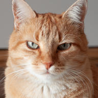

# Gamma-First-Ordered-Dithering

A small experiment in ordered (Bayer) dithering that applies gamma / color-space correction *before* quantization instead of after — giving noticeably more accurate colors and brightness at very low step counts, down to `steps = 1`.

## Why

Most ordered dithering tools you'll find online (e.g. things like ordered-dither-maker) follow the same basic pipeline:

1. Quantize each pixel to N steps using a threshold (Bayer) matrix
2. Apply gamma / color-space correction to the result

This works fine when N is reasonably high, but it breaks down as the step count gets low — especially at `steps = 1`. By that point every pixel has already been forced to a hard 0 or 1 before any correction is applied. Gamma correction on a strictly binary image can't really do anything meaningful: 0 stays 0, and 1 stays 1. The result is a dithered image that looks washed out and low-contrast, because the decision of which pixels turn on or off was made using raw, non-gamma-corrected values instead of perceptually accurate ones.

## The Fix

This experiment just flips the order of operations:

1. Apply gamma / color-space correction to the source image first
2. Quantize against the threshold matrix afterward

Since the values being compared against the dither matrix are already gamma-correct, the *density* of on/off pixels in any given region ends up reflecting the actual perceived brightness of the original image — even at `steps = 1`. Nothing about the dithering algorithm itself changes, just the point in the pipeline where correction happens.

```
Standard approach:  image -> dither -> gamma correct -> output
This approach:      image -> gamma correct -> dither -> output
```

## Examples


| Original | Standard approach | This approach |
|---|---|---|
|  |  |  |

>  **View at 100% scale.** These images must be seen at their actual pixel size —  Zoom to 100% (or open the raw file) before comparing to prevent your browser from downscaling or upscaling the images

## Status

This is an experimental / learning project, I mainly built it to get familiar with GitHub. It works, but expect rough edges. Issues and comparisons against other approaches are welcome. It also processes images pixel-by-pixel in pure Python, so larger images can take a little while.

## Usage

Run it from a folder that contains the image(s) you want to dither:

The script lists every  image in the current folder — enter the number of the one you want to process. Before picking an image, you can type `p` to open the options menu.

The output is saved next to the original as `<filename> - dither.png`.

## Requirements

- Python 3.x
- Pillow
- NumPy


